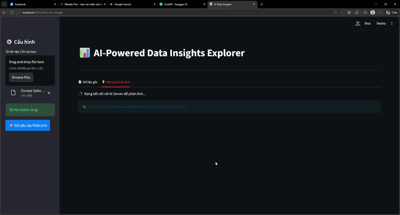

<p align="center">
  <a href="https://www.uit.edu.vn/" title="University of Information Technology" style="border: none;">
    
  </a>
</p>

<h1 align="center"><b>SE363.Q12 - AI Assistant for Business Data</b></h1>

# **SE363 Personal Project: AI Assistant for Business Data (AABD)**

> This project focuses on building an **AI-Powered Data Insights System** that leverages Large Language Models (LLMs) to automatically analyze uploaded datasets and generate comprehensive, actionable business insights. The system processes business data CSV files and produces intelligent summaries along with categorized insights, enabling efficient data-driven decision-making without requiring advanced analytical skills.
> 
> **Technical Highlights:** Integration of **LangChain** for LLM orchestration, **FastAPI** for production-ready REST API, **SQLAlchemy** for database abstraction, and **Streamlit** for interactive data exploration. Supports multiple LLM providers (OpenAI GPT and Google Gemini) for maximum flexibility.

<p align="center">
  
</p>

---

## **Team Information**

| No. | Student ID | Full Name | Role | Github | Email |
| --- | --- | --- | --- | --- | --- |
| 1 | 23521329 | Nguyen Van Quyen | Developer | [quyen244](https://github.com/quyen244) | 23521329@gm.uit.edu.vn |

---

## **Table of Contents**

* [Overview](#overview)
* [System Architecture](#system-architecture)
* [Tech Stack](#tech-stack)
* [Database Schema](#database-schema)
* [Features](#features)
* [Repository Structure](#repository-structure)
* [Installation & Usage](#installation--usage)
* [API Documentation](#api-documentation)
* [Example Queries](#example-queries)
* [DEMO](#demo)
* [Contributing](#contributing)
* [License](#license)

---

## **Overview**

The **AI Assistant for Business Data (AABD)** is an intelligent system that bridges the gap between raw data and actionable insights. Users can upload business datasets, and the system automatically:

1. **Analyzes** the dataset structure, statistics, and content using advanced LLMs
2. **Generates** a comprehensive executive summary of the dataset
3. **Discovers** key insights including trends, correlations, distributions, anomalies, and comparisons
4. **Categorizes** insights by type and importance level
5. **Presents** findings with recommended visualizations and related columns

### **Problem Statement**
Traditional business intelligence tools require users to possess data analysis skills and statistical knowledge to extract meaningful insights from raw data. This creates a barrier for business stakeholders who lack technical expertise. AABD eliminates this barrier by automatically analyzing datasets and presenting pre-generated, categorized insights without requiring manual analysis.

### **Solution**
By combining LangChain with state-of-the-art LLMs (GPT-4 or Gemini), the system intelligently analyzes dataset metadata, statistics, and samples to generate comprehensive insights that are categorized by type (trend, comparison, distribution, correlation, anomaly) and importance level (high, medium, low) with suggested visualizations.

---

## **System Architecture**

```
┌─────────────────────────────────────────────────────────────┐
│                    User Interface Layer                      │
│         (Streamlit Frontend / FastAPI Client)                │
└────────────────────────┬────────────────────────────────────┘
                         │
┌────────────────────────▼────────────────────────────────────┐
│                   API Layer (FastAPI)                        │
│  - Dataset Upload Endpoints                                 │
│  - Insights Generation Endpoints                            │
│  - Metadata & Results Retrieval Endpoints                   │
└────────────────────┬──────────────────────────────────────┬─┘
                     │                                        │
    ┌────────────────▼──────────────┐      ┌────────────────▼──────────────┐
    │    LLM Integration Layer       │      │   Database Layer              │
    │  - LangChain Orchestration     │      │  - SQLAlchemy ORM             │
    │  - GPT/Gemini Providers        │      │  - Dataset Metadata Storage   │
    │  - Insight Generation Engine   │      │  - Insights Storage & Retrieval│
    │  - Prompt Engineering          │      │                               │
    └────────────────┬───────────────┘      └────────────────┬──────────────┘
                     │                                        │
    ┌────────────────▼──────────────────────────────────────▼──────────────┐
    │              Utilities & Config Layer                                 │
    │  - Environment Configuration                                         │
    │  - Logging & Monitoring                                              │
    │  - Input Validation                                                  │
    └─────────────────────────────────────────────────────────────────────┘
                             │
                    ┌────────▼────────┐
                    │  SQLite Database│
                    │  (Production:   │
                    │   PostgreSQL)   │
                    └─────────────────┘
```

---

## **Tech Stack**

| Category | Technology | Purpose |
| --- | --- | --- |
| **LLM Framework** | LangChain | LLM orchestration and chaining |
| **Language Models** | OpenAI GPT, Google Gemini | Natural language understanding |
| **Backend Framework** | FastAPI | REST API server |
| **Frontend Framework** | Streamlit | Interactive dashboard |
| **Web Server** | Uvicorn | ASGI server |
| **Database** | SQLite/PostgreSQL | Data storage and querying |
| **ORM** | SQLAlchemy | Database abstraction layer |
| **Data Processing** | Pandas, NumPy | Data manipulation |
| **Configuration** | python-dotenv | Environment variable management |
| **Validation** | Pydantic | Request/response validation |
| **Logging** | Python logging | System monitoring |
| **Testing** | pytest | Unit and integration tests |
| **Documentation** | Sphinx | API documentation |

---

## **Database Schema**

The system uses PostgreSQL to store dataset metadata and generated insights. The database schema consists of two main tables:

### **Datasets Table**
Stores metadata about uploaded datasets:
```sql
CREATE TABLE datasets (
    id SERIAL NOT NULL,
    filename VARCHAR(255) NOT NULL,
    columns JSONB NOT NULL,
    num_rows INTEGER NOT NULL,
    statistics JSONB NOT NULL,
    sample_data JSONB NOT NULL,
    created_at TIMESTAMP DEFAULT CURRENT_TIMESTAMP,
    PRIMARY KEY(id)
);
```

**Columns:**
- `id`: Unique dataset identifier
- `filename`: Original CSV filename
- `columns`: List of column names (JSON array)
- `num_rows`: Total number of rows
- `statistics`: JSON object containing min, max, mean, std for numeric columns and unique values for categorical columns
- `sample_data`: First few rows of the dataset (JSON)
- `created_at`: Timestamp when dataset was uploaded

### **Datasets Insights Table**
Stores AI-generated insights for each dataset:
```sql
CREATE TABLE datasets_insights (
    id SERIAL NOT NULL,
    dataset_id SERIAL NOT NULL,
    summary TEXT NOT NULL,
    insights JSONB NOT NULL,
    created_at TIMESTAMP DEFAULT CURRENT_TIMESTAMP,
    PRIMARY KEY(id),
    CONSTRAINT datasets_insights_dataset_id_fkey FOREIGN KEY(dataset_id) REFERENCES datasets(id)
);
```

**Columns:**
- `id`: Unique insight record identifier
- `dataset_id`: Foreign key referencing the datasets table
- `summary`: Executive summary of the dataset
- `insights`: JSON array of categorized insights with types, importance levels, and visualizations
- `created_at`: Timestamp when insights were generated

See [docs/DATABASE.md](docs/DATABASE.md) for detailed schema documentation.

---

## **Features**

✅ **Automated Insight Generation** - Upload CSV, get AI-generated insights instantly  
✅ **Multi-LLM Support** - Seamlessly switch between OpenAI GPT and Google Gemini  
✅ **Data Upload** - Import CSV files with automatic parsing and analysis  
✅ **Comprehensive Analysis** - Generates summaries and categorized insights  
✅ **Insight Categorization** - Categorizes insights by type (trend, correlation, anomaly, etc.)  
✅ **Importance Scoring** - Marks insights as high, medium, or low importance  
✅ **Visualization Recommendations** - Suggests optimal chart types for each insight  
✅ **Interactive Dashboard** - Real-time data preview and insight exploration  
✅ **Logging & Monitoring** - Comprehensive system logging  
✅ **Error Handling** - User-friendly error messages with validation feedback  

---

## **Repository Structure**

```
AI Assistant for Business Data/
├── src/                                 # Source code
│   ├── __init__.py
│   ├── llm/                            # LLM integration modules
│   │   ├── __init__.py
│   │   ├── llm_client.py               # Unified LLM provider interface
│   │   ├── insights_generator.py       # Dataset analysis & insight generation
│   │   └── prompt_templates.py         # Reusable prompt templates
│   ├── database/                       # Database layer
│   │   ├── __init__.py
│   │   ├── schema.py                   # SQLAlchemy models
│   │   ├── connection.py               # Database connection handler
│   │   └── queries.py                  # Database query helpers
│   ├── api/                            # FastAPI backend
│   │   ├── __init__.py
│   │   ├── main.py                     # Main FastAPI application
│   │   ├── routes.py                   # API endpoint definitions
│   │   └── models.py                   # Pydantic request/response models
│   ├── frontend/                       # Streamlit frontend
│   │   ├── __init__.py
│   │   └── app.py                      # Main Streamlit application
│   └── utils/                          # Utility modules
│       ├── __init__.py
│       ├── config.py                   # Configuration management
│       ├── logger.py                   # Logging setup
│       └── validators.py               # Input validation functions
├── config/                             # Configuration files
│   ├── __init__.py
│   └── settings.py                     # Application settings
├── tests/                              # Test suite
│   ├── __init__.py
│   ├── test_llm.py                    # LLM module tests
│   ├── test_database.py               # Database module tests
│   └── test_api.py                    # API endpoint tests
├── data/                               # Sample/test data
│   └── sample_data.csv                # Sample CSV for testing
├── docs/                               # Documentation
│   ├── API.md                         # API documentation
│   ├── ARCHITECTURE.md                # Detailed architecture
│   └── DATABASE.md                    # Database documentation
├── .env.example                        # Environment variables template
├── .gitignore                          # Git ignore rules
├── requirements.txt                    # Python dependencies
└── README.md                           # This file
```

---

## **Installation & Usage**

### **Prerequisites**
- Python 3.8+ 
- pip or conda
- API keys for at least one LLM provider (OpenAI GPT or Google Gemini)

### **Step 1: Clone Repository**
```bash
git clone https://github.com/quyen244/AI-Assistant-for-Business-Data.git
cd "AI Assistant for Business Data"
```

### **Step 2: Create Virtual Environment**
```bash
# Using venv
python -m venv venv
source venv/bin/activate  # On Windows: venv\Scripts\activate

# Or using conda
conda create -n aabd python=3.10
conda activate aabd
```

### **Step 3: Install Dependencies**
```bash
pip install -r requirements.txt
```

### **Step 4: Configure Environment Variables**
```bash
# Copy the example file
cp .env.example .env

# Edit .env with your configuration
# Add your API keys and database settings
nano .env  # or use your preferred editor
```

### **Step 5: Initialize Database**
```bash
# Create database and tables
python -m src.database.connection
```

### **Step 6: Run the Application**

#### **Option A: FastAPI Server + Streamlit Frontend**
```bash
# Terminal 1: Start FastAPI server
python -m uvicorn src.api.main:app --reload --port 8000

# Terminal 2: Start Streamlit dashboard
streamlit run src/frontend/app.py
```

#### **Option B: Streamlit Only (Recommended for Development)**
```bash
streamlit run src/frontend/app.py
```

The application will be available at:
- **Streamlit Dashboard**: `http://localhost:8501`
- **FastAPI Server**: `http://localhost:8000`
- **API Docs**: `http://localhost:8000/docs`

---

## **API Documentation**

### **Dataset Insights Generation Endpoint**
```http
POST /datasets/insights
Content-Type: multipart/form-data

file: <CSV_FILE>
```

**Response:**
```json
{
  "message": "Generating insights successfully!",
  "summary": "This dataset contains sales data across multiple regions with 1330 records...",
  "insights": [
    {
      "title": "Strong Growth Trend",
      "description": "Revenue shows consistent upward trend over the analyzed period",
      "related_columns": ["Total Revenue", "Order Date"],
      "insight_type": "trend",
      "importance": "high",
      "suggested_visualization": "line_chart"
    },
    {
      "title": "Regional Performance Variation",
      "description": "Significant differences in sales performance across regions",
      "related_columns": ["Region", "Total Revenue"],
      "insight_type": "comparison",
      "importance": "high",
      "suggested_visualization": "bar_chart"
    }
  ]
}
```

### **Retrieve Dataset Metadata Endpoint**
```http
GET /datasets/{dataset_id}
```

**Response:**
```json
{
  "id": 1,
  "filename": "sales.csv",
  "columns": ["Region", "Country", "Item Type", "Sales Channel", ...],
  "num_rows": 1330,
  "statistics": {
    "numeric": {...},
    "categorical": {...}
  },
  "created_at": "2024-03-12T10:30:00Z"
}
```

### **Retrieve Insights Endpoint**
```http
GET /datasets/{dataset_id}/insights
```

See [docs/API.md](docs/API.md) for complete API documentation.

---
## **Demo**

The interactive web demo allows users to:
1. Input a csv file.
2. View the summary and insights.
3. View the visual plots.

A screenshot of the demo interface is available at:

```text
live-demo.gif
```
<p align="center">
  
</p>

## **Example Insights Generated**

The system automatically generates various types of insights from uploaded datasets:

### **Trend Insights**
- Identifies increasing/decreasing patterns in numeric columns
- Detects seasonal trends and growth trajectories
- Visualizes patterns with line charts

### **Correlation Insights**
- Discovers relationships between different data columns
- Identifies factors that influence key metrics
- Suggests scatter plots for visualization

### **Distribution Insights**
- Analyzes how values are distributed across categories
- Identifies concentration and diversity patterns
- Recommends pie charts or histograms

### **Anomaly Detection**
- Flags unusual values or patterns in data
- Highlights outliers and exceptions
- Aids in data quality assessment

### **Comparative Insights**
- Compares values across categories or time periods
- Identifies top/bottom performers
- Suggests bar charts for comparison visualization

---

## **Contributing**

Contributions are welcome! Please follow these guidelines:

1. Fork the repository
2. Create a feature branch: `git checkout -b feature/your-feature`
3. Commit changes: `git commit -am 'Add your feature'`
4. Push to branch: `git push origin feature/your-feature`
5. Submit a pull request

---

## **License**

This project is licensed under the MIT License - see LICENSE file for details.

---

## **Contact & Support**

For questions or issues, please contact:
- **Developer**: Nguyen Van Quyen
- **Email**: 23521329@gm.uit.edu.vn
- **GitHub**: [quyen244](https://github.com/quyen244)

---

**Last Updated**: March 5, 2026  
**Status**: 🚀 Active Development
